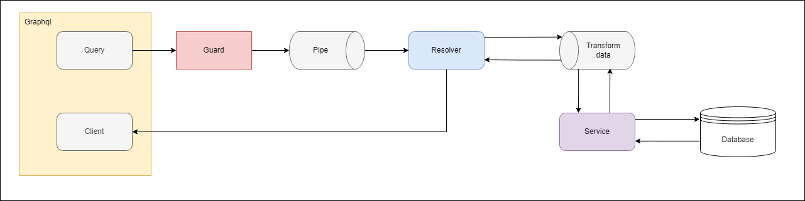

<div align="center">

# Instagram Project

_Basic Instagram operating model_

<p> Project using <a href="http://nodejs.org" target="_blank">Node.js</a> framework for building server-side applications. coding by <a href="https://github.com/Desplay" targer="_blank">Desplay</a></p>

</div>

# Use

<div align="center">


</div>

# Highlights

- Using Nesjs framework, GraphQL, MongoDB, easy to use and develop
- Basic SignIn, SignUp Account, password is encrypted
- Upload file to Cloudinary
- Send email to verify account
- Using JWT to authenticate

# Basic functions graphs

<div align="center">



</div>

# Description

| Module                                                         | Description          |
| -------------------------------------------------------------- | -------------------- |
| [NestJS](https://nestjs.com/)                                  | Core Module          |
| [MongoDB](https://www.mongodb.com/)                            | Database             |
| [GraphQL](https://graphql.org/)                                | graphql module       |
| [TypeScript](https://www.typescriptlang.org/)                  | Programming Language |
| [NodeMailer](https://nodemailer.com/about/)                    | Send email           |
| [Mongoose](https://mongoosejs.com/docs/queries.html)           | Connect to database  |
| [Cloudinary](https://cloudinary.com/)                          | Upload file to cloud |
| [Bcrypt](https://www.npmjs.com/package/bcrypt)                 | encrypt password     |
| [Graphql-upload](https://www.npmjs.com/package/graphql-upload) | Upload file module   |

# Deployment

[Adaptable.io](https://adaptable.io/) : [Deploy Link](https://nestjsgraphqlbasic.adaptable.app/graphql)

# Guide to use

## Clone project

```bash
git clone https://github.com/Desplay/NestJS_MongoDB_GraphQL_Basic.git
```

## Install dependencies

```bash
npm install --force
```

## Run project

```bash
npm run start:dev
```

# License

[MIT licensed](LICENSE).

# Contact

- [Facebook](https://www.facebook.com/Desplay)

- [Email](mailto:desplayshido@gmail.com)

- [Github](https://github.com/Desplay)

# Author & Contributors

[](https://github.com/Desplay/NestJS_MongoDB_GraphQL_Basic/graphs/contributors)
